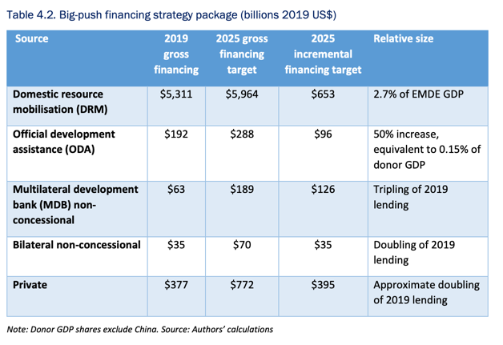

# Methodology

The repository works to replicate and update the analysis summarised by the following table:

More details on the sources and methodology can be found in this [document](https://www.lse.ac.uk/granthaminstitute/wp-content/uploads/2022/05/Financing-the-big-investment-push-in-emerging-markets-and-developing-economies-for-sustainable-resilient-and-inclusive-recovery-and-growth-1.pdf)

The following sections break down the methodology, data, and notes around each of the financing sources.

## Domestic Resource Mobilisation
The paper discusses the need to mobilise additional [domestic resources](https://www.lse.ac.uk/granthaminstitute/wp-content/uploads/2022/05/Financing-the-big-investment-push-in-emerging-markets-and-developing-economies-for-sustainable-resilient-and-inclusive-recovery-and-growth-1.pdf#page=51&zoom=100,93,648). The authors focus on resources from Emerging and Developing Economies (EMDEs), excluding China.

The current list of EMDEs can be found [here](https://www.imf.org/en/Publications/WEO/weo-database/2024/April/groups-and-aggregates#oem).

We follow the same methodology in our calculations. The source of "DRM" data is the IMF World Economic Outlook (WEO, April 2024). We use _General Government Revenue, as a share of GDP indicator (GGR_NGDP)_. This indicator measures the total revenue collected by the government (which includes central, state, and local governments) as a share of the country’s nominal Gross Domestic Product (GDP). This encompasses all revenues collected by the government, including taxes, social contributions, and other receipts (e.g., fines, fees, and income from government-owned enterprises).

We convert data to US dollars by multiplying the share of nominal GDP by the nominal GDP value in US dollars (indicator _NGDPD_). Last, we convert to constant prices using GDP deflators data from the IMF World Economic Outlook.

**Note**: The latest values, which include projections, are for 2029. We could use 2023 or 2022 for an assessment of progress.

### Key differences
Our numbers are a bit different from the original paper. While we use the **same indicator**
and the **same group of countries**, we don't use the same WEO version. Our research takes the latest available version (April 2024, as of writing). That means certain estimates and exchange rates may have been revised or changed since the April 2021 version used by the original authors.

## Official Development Assistance (ODA)
The paper discusses the need to mobilise additional [ODA](https://www.lse.ac.uk/granthaminstitute/wp-content/uploads/2022/05/Financing-the-big-investment-push-in-emerging-markets-and-developing-economies-for-sustainable-resilient-and-inclusive-recovery-and-growth-1.pdf#page=51&zoom=100,93,648). 

The authors focus on the "recipient perspective". That means they consider gross disbursements from official donors: DAC members, non-DAC members, and multilateral organisations.

Gross disbursements are different from what is considered as headline ODA by the OECD. Since 2018, the OECD reports on a grant equivalent basis. That means that loans don't get reported at face value, but at discounted amount considered to be equivalent to a grant.

By definition, gross disbursements are higher than net disbursements or grant equivalents because in any given year they take all the money disbursed, even if some will have to be paid back (with interest) in the future.

The authors take total gross disbursements to all developing countries. This amount **includes** money that is reported as 'Developing Countries, unspecified' but that is actually spent in donor countries. That includes in-donor refugee costs (IDRC), in-donor student costs, and other non-flows like debt relief or development awareness spending.

For consistency we align with their methodology.

**Note**: The latest values are for 2022.

### Key differences
Our numbers are slightly lower for 2019 because we **exclude China** as a recipient.

## Multilateral Development Bank (MDB) non-concessional financing
The paper discusses the need for additional [non-concessional financing](https://www.lse.ac.uk/granthaminstitute/wp-content/uploads/2022/05/Financing-the-big-investment-push-in-emerging-markets-and-developing-economies-for-sustainable-resilient-and-inclusive-recovery-and-growth-1.pdf#page=51&zoom=100,93,648) from MDBs.

The authors do not report an official list of MDBs included in their calculations, nor the exact source of this data. 

We replicated their numbers via the World Bank International Debt Statistics database.

In order to get non-concessional lending, we use two indicators:
- Multilateral disbursements (`DT.DIS.MLAT.CD`)
- Multilateral concessional disbursements (`DT.DIS.MLTC.CD`)

Non-concessional disbursements are calculated as Multilateral disbursements minus multilateral concessional disbursements.

We also filter the data to include only multilateral development banks (excluding funds like _Arab Monetary Fund_ or _European Development Fund (EDF)_, or investment banks like _Nordic Investment Bank_).

We exclude China from the list of borrowers.

**Note**: The latest values are for 2022.

### Key differences
There are no notable differences in approach as far as we are aware.

## Bilateral non-concessional financing
The paper discusses the need for additional [non-concessional financing](https://www.lse.ac.uk/granthaminstitute/wp-content/uploads/2022/05/Financing-the-big-investment-push-in-emerging-markets-and-developing-economies-for-sustainable-resilient-and-inclusive-recovery-and-growth-1.pdf#page=51&zoom=100,93,648) from bilateral providers.

While the authors do not provide an exact definition of non-concessional bilateral financing, their discussion focuses on non-concessional lending.

We replicated their numbers via the World Bank International Debt Statistics database.

In order to get non-concessional lending, we use two indicators:
- Bilateral disbursements (`DT.DIS.BLAT.CD`)
- Bilateral concessional disbursements (`DT.DIS.BLTC.CD`)

Non-concessional disbursements are calculated as Bilateral disbursements minus bilateral concessional disbursements.

We exclude China from the list of borrowers.

**Note**: The latest values are for 2022.

### Key differences
While the original methodology doesn't specify the detail of bilateral lenders, we exclude China from the list of lenders. 

